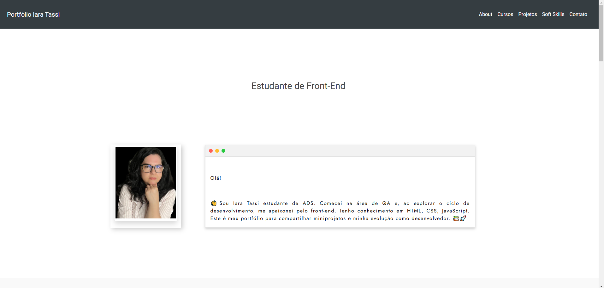

# 🌟 Meu Portfólio de Futura Desenvolvedora

Este é o meu portfólio pessoal, criado para mostrar minha trajetória como estudante de tecnologia. Aqui você encontrará informações sobre mim, os cursos que realizei, meus projetos e minhas **soft skills**.

## 🌐 Acesse meu portfólio completo
Você pode visualizar meu portfólio online no seguinte link:

[🔗 Acesse Meu Site](https://new-portfolio-iara-tassi.vercel.app/)

--- 

## 📷 Demonstração do Projeto



---

## 🛠 Ferramentas utilizadas

- Vite
- React
- TypeScript
- Bootstrap 5
- Vitest
- React Testing Library

## 📌 Seções do portfólio

- **Sobre mim**: Um resumo da minha jornada e motivação na área de tecnologia.
- **Cursos**: Lista dos cursos que realizei, com foco em desenvolvimento web e outras áreas relacionadas.
- **Projetos**: Exemplos práticos do que desenvolvi, incluindo projetos feitos durante cursos e de forma independente.
- **Soft skills**: Competências interpessoais que complementam minhas habilidades técnicas.
- **Contato**: Como entrar em contato comigo ou visualizar meu perfil em redes sociais.

---

## 🚀 Destaques

### 🎓 Cursos

Listei os cursos que completei para mostrar meu aprendizado contínuo. Alguns deles incluem:

- Desenvolvimento Web Completo
- Front-End com React e Bootstrap
- Fundamentos de JavaScript, HTML e CSS
- Java do básico ao nível médio
- Angular e React
- Testes de Software (QA)

[Visualizar todos os cursos](#)

---

### 📂 Projetos

#### 📝 Projetos feitos durante os cursos:

- **Spiderman**: Projeto Spiderman Multiverso, desenvolvido durante uma live no Youtube em parceria com a DIO.
- **Barbearia**: Um projeto simples para praticar HTML e CSS.
- **Número Secreto**: Projeto Jogo do número Secreto, objetivo de praticar de Lógica de programação. Projeto desenvolvido pela Oracle Oracle - One Next Education.

#### 🌟 Projetos independentes:

- **Portfólio pessoal**: Este site, desenvolvido do zero, utilizando React e Bootstrap 5.
- **Site Clínica Odontologica**: Projeto em desenvolvimento.

---

### ✨ Soft Skills

- Comunicação eficaz
- Colaboração
- Adaptabilidade
- Resiliência

---

## 🧪 Testes Automatizados

Os testes do projeto garantem a funcionalidade correta e a integração dos componentes, cobrindo diferentes cenários, como animações, renderização e lógica baseada em visibilidade.

### ✔ Como Executar os Testes

1. **Execute os testes automatizados:**
   ```bash
   npm test
   ```

## 📧 Contato

- **E-mail**: [iaratassi@hotmail.com](mailto:iaratassi@hotmail.com)
- **LinkedIn**: [iara-tassi](https://www.linkedin.com/in/iara-tassi-b1879182/)
- **GitHub**: [IaraTassi](https://github.com/IaraTassi)

---

> Feito com ❤️ por Iara .

```

```
